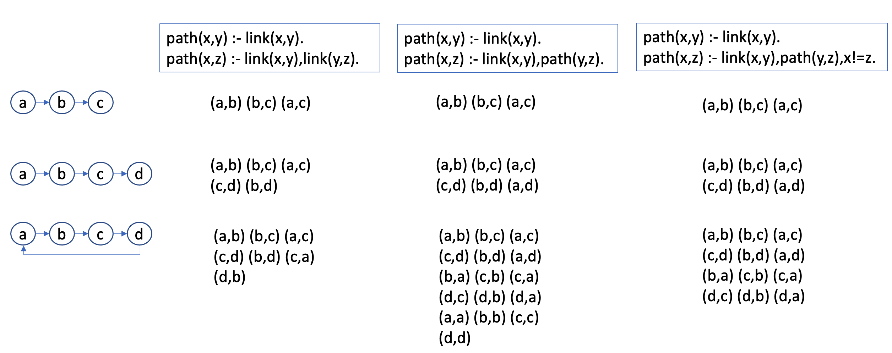

# Active learning example

We give an example of NetSpec's active learning process, 
using the path finding example, where the desired solution 
is the following:
```
path(x,y) :- link(x,y).
path(x,z) :- link(x,y),path(y,z).
```

Now let's consider after synthesis, NetSpec finds three candidate programs
that are consistent with the specified input-output examples (top row in 
the following figure), and it tries to disambiguate them by randomly generating 
new input tables. For instance, let's compare three possible new input
talbes shown in the first column in the following figure:

 

The derived output ``path`` tuples are shown in the corresponding cell in 
the table.

Next we compute the entropy of each input table, following the formula:
,
where ``O`` ranges over the set of all program outputs,
``p_O`` is the fraction of programs that produce ``O`` as output.


1. ``I1``: three programs generate the same output, the disbritution of ``P_O`` is a singleton set ``{1}`` thus its entropy = 0.
2. ``I2``: there is a 2-1 split among the program outputs, so the distribution of ``P_O`` is ``{0.33,0.66}``. So ``I2``'s entropy is 
3. ``I3``: three programs generate distinct outputs, the disbrituion of ``P_O`` is ``{0.33,0.33,0.33}``. So ``I3``'s entropy is 

Thus by maximizing entropy, ``I3`` is chosen as the next query.
